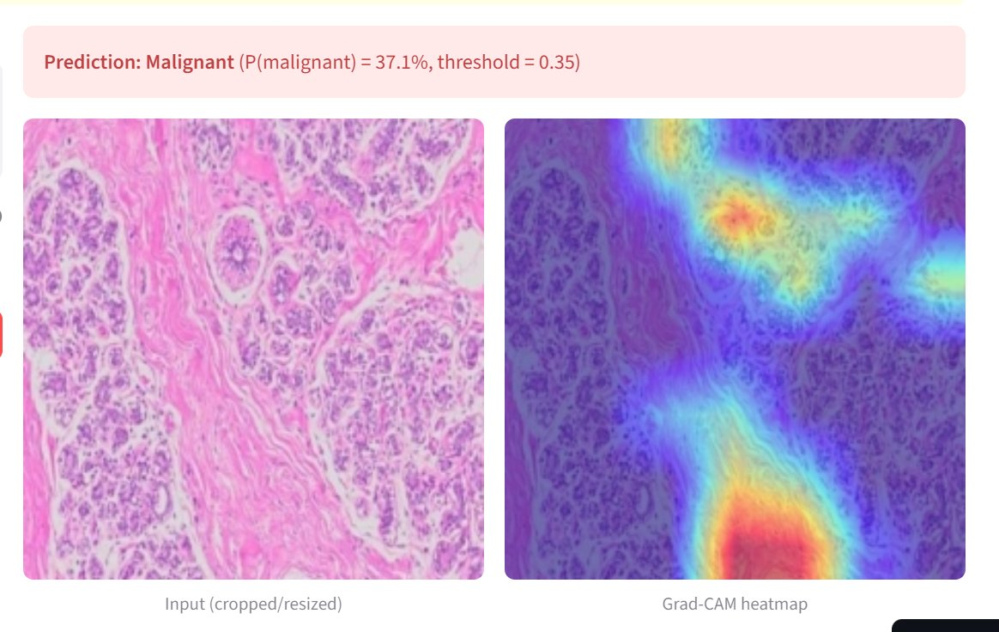
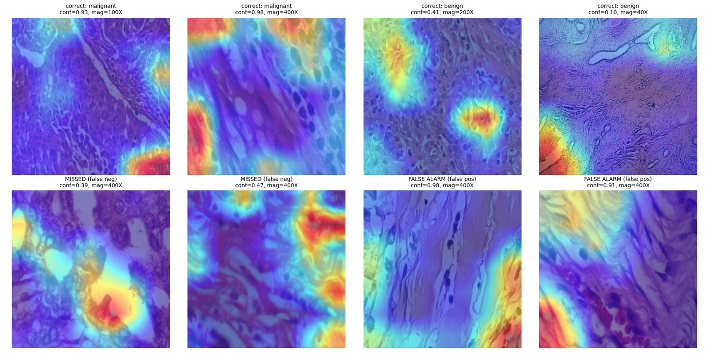
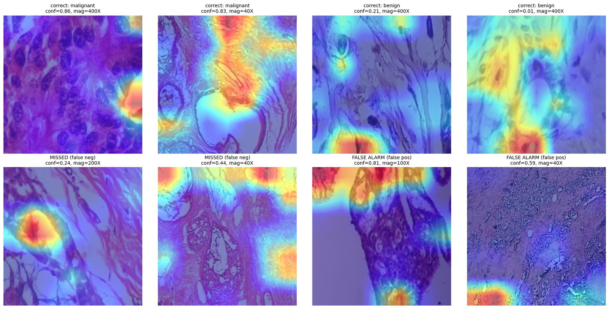

# Breast Cancer Histopathology Classifier

A deep learning pipeline that classifies breast tissue histopathology images as **Benign** or **Malignant**, with a built-in explainability layer (Grad-CAM) so predictions aren't a black box. Trained on the public BreaKHis dataset using transfer learning, evaluated with a patient-level split to avoid data leakage, and deployed as a live interactive demo.

**Live demo:** [breast-cancer-classifier-nvht3vafhqswaeqmwpzntq.streamlit.app](https://breast-cancer-classifier-nvht3vafhqswaeqmwpzntq.streamlit.app/)



---

## Why this project

Most beginner breast cancer ML projects use the Wisconsin Diagnostic dataset — a small table of pre-extracted numeric features (radius, texture, perimeter, etc.). It's a well-solved, low-stakes classification problem.

This project instead works directly with raw microscope images of tissue biopsies — a genuine computer vision problem, closer to what a pathologist actually looks at. The goal wasn't just to hit a good accuracy number, but to build something that:

- handles the real methodological traps in medical imaging (patient-level data leakage, class imbalance, threshold selection)
- explains *why* it made a prediction, not just what the prediction was
- gets honestly evaluated, including the mistakes and dead ends along the way

## Results

Final model: EfficientNetB0 (transfer learning, last block fine-tuned), evaluated on a held-out test set the model never saw during training or validation.

| Metric | Score |
|---|---|
| Accuracy | 82.6% |
| Precision | 83.9% |
| Recall (malignant) | 91.9% |
| F1 | 0.877 |
| ROC-AUC | 0.818 |

**Recall is prioritized over raw accuracy.** In a diagnostic screening context, a missed cancer case (false negative) is far costlier than a false alarm that gets double-checked by a doctor. The app's decision threshold defaults to **0.35** instead of the standard 0.5, based on an explicit precision/recall tradeoff analysis (see [Methodology](#methodology)) — this catches significantly more true cancer cases at the cost of more false positives, which is the right tradeoff for this use case.

## Methodology

### 1. Data and splitting
BreaKHis contains ~7,900 histopathology images from 82 patients (2,480 benign / 5,429 malignant), across four magnification levels (40X, 100X, 200X, 400X). Images were split **by patient**, not by image — since a patient can have hundreds of tissue images, a naive random split risks leaking the same patient's tissue into both train and test sets, which would let the model partly memorize patients instead of learning general tumor patterns. The split was also balanced to keep both class ratio and total image count close to 70/15/15 across train/val/test, since per-patient image counts ranged from 38 to 246.

### 2. Baseline and fine-tuning
A frozen-backbone baseline (EfficientNetB0 pretrained on ImageNet, only a new classification head trained) established a starting point of ~0.83 val F1. Unfreezing the last 3 backbone blocks for fine-tuning initially made things *worse* (val_f1 dropped, val_loss rose every epoch from epoch 1) — a clear overfitting signal from too much trainable capacity (3.16M params, 78.8% of the network) relative to the dataset size. Reducing to just the last block, adding weight decay, and fixing a random seed for reproducible comparisons fixed this and gave a real, verified improvement over baseline.

### 3. Diagnosing and addressing an edge-bias artifact
Grad-CAM visualizations revealed the model was, in some cases, focusing on the image border/corners rather than actual tissue structure — including one false positive at 98% confidence with the heatmap sitting entirely on a border strip. Center-cropping the input images (removing ~20% of the border before training) measurably improved both accuracy (80.6% → 82.6%) and false negatives (72–84 → 58), and visibly reduced border-focused attention in Grad-CAM outputs.

A follow-up experiment cropped more aggressively (~30% border removed) to try to eliminate the remaining border-bias entirely. This made results *worse* across every metric, and the edge-bias persisted anyway. This is a meaningful finding, not just a failed attempt: it suggests the artifact isn't really about the original photo's border, but a known characteristic of convolutional layers, where zero-padding at *whatever* boundary the network is given can create a faint learnable signal near that edge — cropping tighter just creates a new edge in the same place, relative to the network's receptive field. The moderate crop was kept as final since it captured the real improvement without over-cropping useful tissue content.

**Before the fix** — note the heatmap sitting on the image border in several panels, including a 98%-confidence false positive:


**After the moderate crop fix** — attention shifts toward central tissue structure in most cases:


**Known limitation:** border-focused attention is reduced but not fully eliminated in the final model. Future work could explore lesion-guided ROI cropping instead of a fixed geometric crop.

### 4. Threshold tuning
Rather than using the default 0.5 classification cutoff, the test set was evaluated across a range of thresholds to make an explicit, documented tradeoff decision:

| Threshold | Recall | Precision | False Negatives | False Positives |
|---|---|---|---|---|
| 0.50 | 91.3% | 81.6% | 69 | 163 |
| 0.40 | 93.7% | 80.2% | 50 | 184 |
| **0.35** | **94.2%** | **79.6%** | **46** | **192** |
| 0.30 | 95.3% | 78.6% | 37 | 206 |
| 0.25 | 96.3% | 77.6% | 29 | 220 |

0.35 was chosen as the deployed default — a meaningful recall gain over 0.5 without pushing false positives excessively high. The live demo exposes this as an adjustable slider so the tradeoff isn't hidden behind one fixed number.

### 5. Explainability
Grad-CAM (implemented from scratch — see `app.py`) generates a heatmap showing which regions of the image most influenced the model's prediction, by hooking the final convolutional layer to capture activations and gradients during a forward/backward pass. This is shown alongside every prediction in the live demo, not as an afterthought.

## Tech stack

- **Training:** PyTorch, torchvision (EfficientNetB0 transfer learning), scikit-learn (metrics), albumentations (augmentation), Google Colab (GPU)
- **Explainability:** custom Grad-CAM implementation (pure PyTorch, no external CAM library — see notes below)
- **Deployment:** Streamlit Community Cloud
- **Data:** [BreaKHis dataset](https://web.inf.ufpr.br/vri/databases/breast-cancer-histopathological-database-breakhis/)

## Repository structure

```
├── app.py                       # Streamlit app (deployed)
├── requirements.txt             # Python dependencies
├── packages.txt                 # system-level apt dependencies for deployment
├── finetuned_model_cropped.pt   # trained model weights (final version)
├── LICENSE
└── README.md
```

## Running locally

```bash
git clone https://github.com/m-haseeb-ul-hassan/breast-cancer-classifier.git
cd breast-cancer-classifier
pip install -r requirements.txt
streamlit run app.py
```

## A note on the deployment

Getting this deployed for free surfaced a chain of real infrastructure issues worth documenting honestly rather than hiding: Hugging Face Spaces recently restricted free Gradio/Docker SDK creation, which pushed deployment to Streamlit Community Cloud instead. From there, `opencv-python-headless` (used by the `pytorch-grad-cam` library) repeatedly failed due to missing system libraries and apt dependency conflicts in the cloud environment. Rather than continuing to patch around a third-party library's dependency chain, Grad-CAM was reimplemented directly in PyTorch (~40 lines), which removed the dependency entirely and, as a side effect, meant actually understanding the algorithm well enough to write it rather than just calling a library function.

## AI-assistance disclosure

This project was built with AI assistance for implementation support, debugging, and deployment troubleshooting, under my direction — I made the architectural decisions (patient level splitting, crop based fix for the edge bias finding, threshold selection), ran and interpreted every experiment, and diagnosed the issues described above (the overfitting reversal, the edge-bias investigation, the deployment dependency chain) myself before deciding how to address them.

## Acknowledgments

Spanhol, F., Oliveira, L. S., Petitjean, C., Heutte, L., *A Dataset for Breast Cancer Histopathological Image Classification*, IEEE Transactions on Biomedical Engineering, 2016.

## License

MIT — see [LICENSE](LICENSE)

---

**Disclaimer:** This is a student research/portfolio project, not a validated medical device. It should never be used for real diagnostic decisions.
